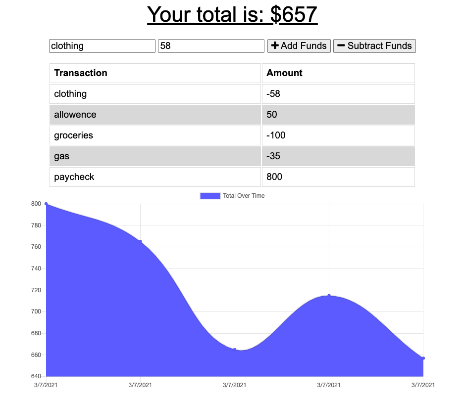

# budgetApp

The budgetApp is a mobile first application used to track expenditures. It's functionality includes naming a transaction, setting a transaction amount, and setting deposit or payment. 

With each transaction, a graph of user spending is generated to show trends in deposit or payments. 

 

View the deployed heroku application here: https://afternoon-coast-65587.herokuapp.com/ 

## About the Developer
My name is Naomi and I am a junior developer studying fullstack javascript developement through UCLA extension. Visit my github at https://github.com/naomiilang

Thanks for stopping by :) 